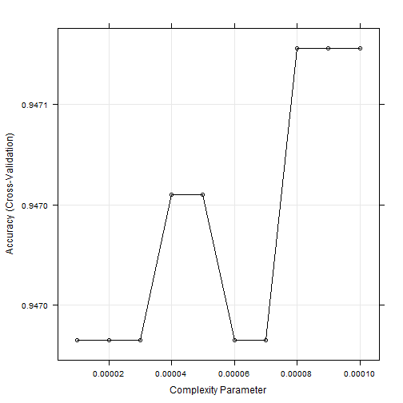
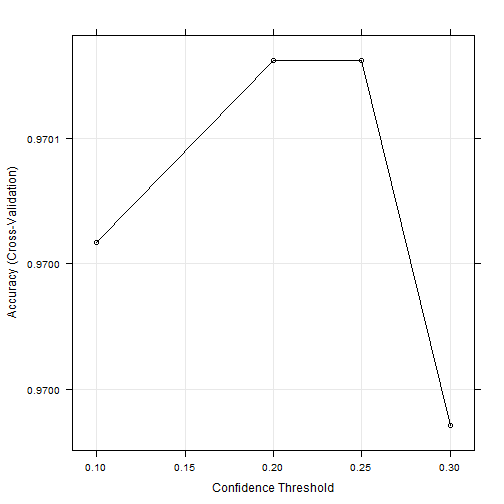
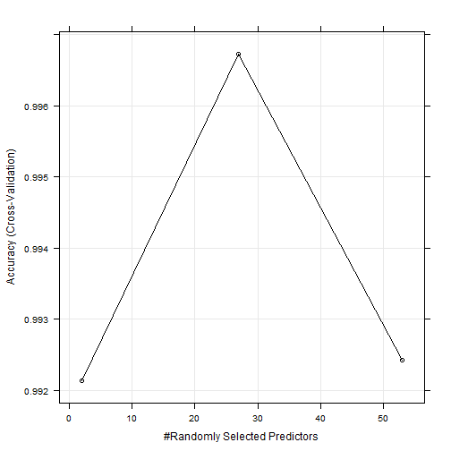
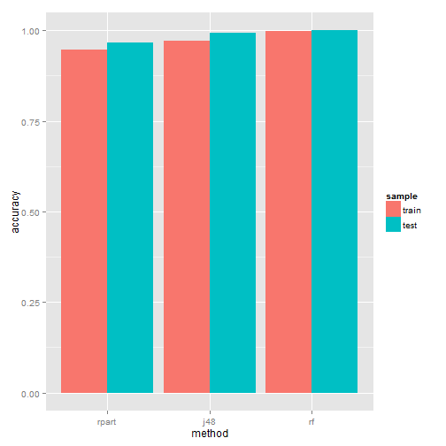

## Synopsis

Using devices such as Jawbone Up, Nike FuelBand, and Fitbit it is now possible to collect a large amount of data about personal activity relatively inexpensively. These type of devices are part of the quantified self movement.
The goal of this project was predict how well a person perform barbell lifts. To perform the predicction we used three algoritms based in decision tree (rpart,J48 and random forest). The data set contains data from accelerometers on the belt, forearm, arm, and dumbell of 6 participants. More information is available from the website here: http://groupware.les.inf.puc-rio.br/har.
We found that the method random forest had the best accurancy.


## Libraries

```r
library(caret)
source("functions.R")
```

## Loading and Processing the Raw Data


```r
train<-read.csv(file="datos/pml-training.csv",na.strings=c("NA",""))
test<-read.csv(file="datos/pml-testing.csv",na.strings=c("NA",""))
```

In order to get the tidy data set, firstly we computed the number of NA for each variable. 


```r
countNA<-resumen(train)
head(countNA)
```

```
##                variable    na    pna
## 12   kurtosis_roll_belt 19216 0.9793
## 13  kurtosis_picth_belt 19216 0.9793
## 14    kurtosis_yaw_belt 19216 0.9793
## 15   skewness_roll_belt 19216 0.9793
## 16 skewness_roll_belt.1 19216 0.9793
## 17    skewness_yaw_belt 19216 0.9793
```

We can see that there are many variables with larget percentage of NA's, rougly 100%. Due to, we eliminated these variables.


```r
tidyTrain<-train[,countNA[countNA$na==0,]$variable]
```

In addition, also we eliminated the variables related with user identification, time and date.


```r
tidyTrain<-tidyTrain[,-1:-6]
dim(tidyTrain)
```

```
## [1] 19622    54
```
 
Now the tidy data set have 19622 instances and 54 variables, where 53 are predictors.

## Modelling

In order to find the best model to predict, firstly we created two samples, the training and testing samples.
The 70% of data set were to the training sample and the remaining were to the testing.


```r
inTrain<-createDataPartition(y=tidyTrain$classe,p=0.7,list=F)
training<-tidyTrain[inTrain,]
testing<-tidyTrain[-inTrain,]
```

We used three kind of methods, rpart, jr8 y random forest, the metric to evaluation was the accuracy and also we used cross-validation with 3 folds.


```r
fitControl <- trainControl(method = "cv",number = 3)
```
### rpart

In order to find the best model, we built rpart's models with distinct values to cp(complexity parameter).


```r
set.seed(10000)
cps<-seq(0.00001, 0.0001, by= 0.00001)
cartGrid <-  expand.grid(cp = cps)
modCart<-train(classe~.,method="rpart",
              data=training,
              trControl = fitControl,
              tuneGrid = cartGrid
)
```


```r
accCartTrain<-max(modCart$results$Accuracy)
```


```r
plot(modCart)
```

 

The above figure show us that the best cp is 0.0001, because with this cp the accuracy is the highest.
After that, que campute the accuracy with the testing sample.


```r
predCart<-predict(modCart, newdata = testing)
cmCartTest<-confusionMatrix(data = predCart, testing$classe)
accCartTest<-cmCartTest$overall["Accuracy"]
```

The accuracy in the training sample and testing sample are shown below.


```r
accCartTrain
```

```
## [1] 0.9471
```

```r
accCartTest
```

```
## Accuracy 
##   0.9655
```

### J48

In order to find the best model, we built J48's models with distinct values to C(confidence threshold).


```r
set.seed(10000)
j48Grid<- expand.grid(C = c(0.1,0.2,0.25,0.3))
modJ48<-train(classe~.,method="J48",
                 data=training,
                 trControl = fitControl,
                 tuneGrid = j48Grid
)
```


```r
accJ48Train<-max(modJ48$results$Accuracy)
```


```r
trellis.par.set(caretTheme())
plot(modJ48)
```

 

The above figure show us that the best C is 0.2, because with this C the accuracy is the highest.
After that, que campute the accuracy with the testing sample.


```r
predJ48<-predict(modJ48, newdata = testing)
cmJ48Test<-confusionMatrix(data = predJ48, testing$classe)
accJ48Test<-cmJ48Test$overall["Accuracy"]
```

The accuracy in the training sample and testing sample are shown below.


```r
accJ48Train
```

```
## [1] 0.9701
```

```r
accJ48Test
```

```
## Accuracy 
##   0.9934
```

### Random Forest

In order to find the best model, we built rf's models with distinct values to mtry(randomly selected predictors).


```r
set.seed(10000)
modRF<-train(classe~.,data=training,method="rf",trControl=fitControl)
```


```r
accRfTrain<-max(modRF$results$Accuracy)
```


```r
plot(modRF)
```

 

The above figure show us that the best mtry is 27, because with this mtry the accuracy is the highest.
After that, que campute the accuracy with the testing sample.


```r
predRf<-predict(modRF, newdata = testing)
cmRfTest<-confusionMatrix(data = predRf, testing$classe)
accRfTest<-cmRfTest$overall["Accuracy"]
```

The accuracy in the training sample and testing sample are shown below.


```r
accRfTrain
```

```
## [1] 0.9967
```

```r
accRfTest
```

```
## Accuracy 
##   0.9995
```

After that, we compare the accuracy for the three methods.


```r
result<-data.frame(method="rpart",sample="train",accuracy=accCartTrain)
result<-rbind(result,data.frame(method="rpart",sample="test",accuracy=accCartTest))
result<-rbind(result,data.frame(method="j48",sample="train",accuracy=accJ48Train))
result<-rbind(result,data.frame(method="j48",sample="test",accuracy=accJ48Test))
result<-rbind(result,data.frame(method="rf",sample="train",accuracy=accRfTrain))
result<-rbind(result,data.frame(method="rf",sample="test",accuracy=accRfTest))
rownames(result)<-NULL
result
```

```
##   method sample accuracy
## 1  rpart  train   0.9471
## 2  rpart   test   0.9655
## 3    j48  train   0.9701
## 4    j48   test   0.9934
## 5     rf  train   0.9967
## 6     rf   test   0.9995
```

```r
ggplot(data=result,aes(x=method,y=accuracy,fill=sample))+
        geom_bar(stat="identity",position = "dodge")
```

 

The above figure show us that the best method is rf(random forest), because with this mehtod the accuracy was the highest.

## Prediction.

We concluded that the best model was rf (random forest) with mytry 27, now with this model we predicted the classes to the new instances.


```r
tidyTest<-test[,names(tidyTrain[,-54])]
answers<-predict(modRF, newdata = tidyTest)
answers
```

```
##  [1] B A B A A E D B A A B C B A E E A B B B
## Levels: A B C D E
```

```r
pml_write_files(answers)
```

## Appendix


```r
sessionInfo()
```

```
## R version 3.0.3 (2014-03-06)
## Platform: x86_64-w64-mingw32/x64 (64-bit)
## 
## locale:
## [1] LC_COLLATE=Spanish_Argentina.1252  LC_CTYPE=Spanish_Argentina.1252   
## [3] LC_MONETARY=Spanish_Argentina.1252 LC_NUMERIC=C                      
## [5] LC_TIME=Spanish_Argentina.1252    
## 
## attached base packages:
## [1] parallel  stats     graphics  grDevices utils     datasets  methods  
## [8] base     
## 
## other attached packages:
##  [1] knitr_1.6           markdown_0.6.5      randomForest_4.6-10
##  [4] doParallel_1.0.8    iterators_1.0.7     foreach_1.4.2      
##  [7] RWeka_0.4-24        rpart_4.1-5         caret_6.0-41       
## [10] ggplot2_1.0.0       lattice_0.20-27    
## 
## loaded via a namespace (and not attached):
##  [1] BradleyTerry2_1.0-6 brglm_0.5-9         car_2.0-24         
##  [4] class_7.3-9         codetools_0.2-8     colorspace_1.2-2   
##  [7] compiler_3.0.3      digest_0.6.3        e1071_1.6-4        
## [10] evaluate_0.5.3      formatR_0.10        grid_3.0.3         
## [13] gtable_0.1.2        gtools_2.7.1        htmltools_0.2.4    
## [16] labeling_0.2        lme4_1.1-7          MASS_7.3-29        
## [19] Matrix_1.1-2        mgcv_1.7-28         minqa_1.2.4        
## [22] munsell_0.4.2       nlme_3.1-113        nloptr_1.0.4       
## [25] nnet_7.3-7          pbkrtest_0.4-2      plyr_1.8.1         
## [28] proto_0.3-10        quantreg_5.11       Rcpp_0.11.1        
## [31] reshape2_1.4        rJava_0.9-6         rmarkdown_0.2.64   
## [34] RWekajars_3.7.12-1  scales_0.2.4        SparseM_1.6        
## [37] splines_3.0.3       stringr_0.6.2       tools_3.0.3        
## [40] yaml_2.1.11
```


